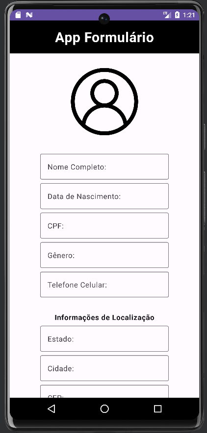

# appFormulario
Aplicativo Android de formulário desenvolvido em Kotlin e Jetpack Compose

## Funcionamento
- Clone o repositório em sua máquina e abra o projeto no Android Studio (versão Jellyfish 2023.3.1 ou mais atualizada)
- Use o emulador do Android Studio ou emule em seu dispositivo móvel Android via cabo ou Wi-Fi

## Notas de versão
- v1: Aplicativo de formulário, com máscaras em campos de data, CPF, telefone e CEP
- v2: Adição de campos de localização, mudança na coloração do botão, e outros ajustes mínimos de funcionamento
